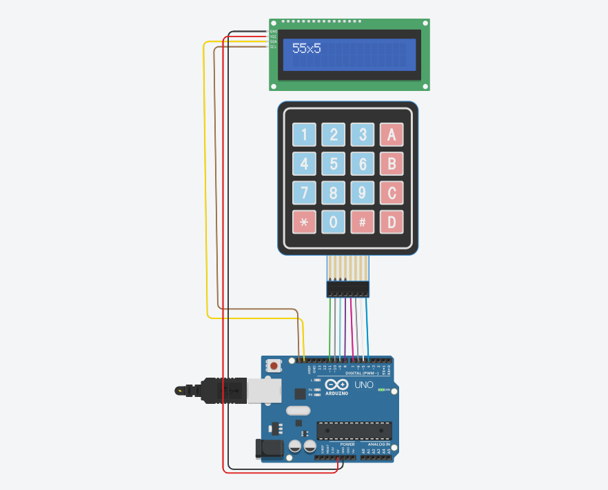

# Smart Calculator Firmware

 
  

A robust, state-machine-driven calculator firmware designed for microcontrollers. This project implements a fully functional calculator with a 4x4 matrix keypad and a 16x2 I2C LCD, featuring standard arithmetic, factorial calculations with overflow protection, and special operational modes.

## 🌐 Live Simulation

You can test and interact with the calculator circuit directly in your browser without any hardware setup using Tinkercad:
*👉 **[Run the Smart Calculator Simulation on Tinkercad](https://www.tinkercad.com/things/jma5w2xD1lB-mini-project-sc-cohort-2?sharecode=2cB-oheXFu3R7yPCmdYdtdWurur4vT3tMj6btMrqQbY)**
*👉 **[Arduino Code](https://github.com/Awad235/smart-calculator-Cohort-2/blob/main/Final-SC-Code.cpp)**

## 💻 Language & Tech Stack

* **Language:** **C++** (Arduino/AVR dialect)
* **Memory Management:** Strictly utilizes standard `char` arrays (C-strings) over dynamic `String` objects to prevent heap fragmentation in memory-constrained embedded environments.

## 🛠️ Hardware Requirements

* Arduino Uno / Nano (or compatible 8-bit AVR microcontroller)
* 16x2 Character LCD with I2C Backpack (Address `0x27`)
* 4x4 Matrix Keypad
* Jumper wires

## 📚 Dependencies

This project relies on the following standard and third-party libraries:
* `Wire.h` - For I2C communication with the LCD.
* `LiquidCrystal_I2C.h` - For driving the 16x2 display.
* `Keypad.h` - For non-blocking matrix keypad scanning and debouncing.
* `math.h` - For advanced mathematical operations (`pow`, `sqrt`, `round`).

## ✨ Features

* **Basic Arithmetic:** Addition (`+`), Subtraction (`-`), Multiplication (`x`), and Division (`/`).
* **Advanced Modes:** * **Power Mode (`a^b`):** Triggered by pressing `C` twice.
    * **Square Root Mode (`√a`):** Triggered by pressing `D` twice.
    * **Percent Mode (`a * b / 100`):** Triggered by entering a number, pressing `C`, then `*`.
* **Factorial (`!`):** Calculates factorials up to 12! with built-in overflow protection.
* **Error Handling:** Safely catches and handles "Division by Zero" and "Overflow" errors without crashing the system.
* **Hardware Reset:** Software-triggered state reset by double-pressing `A`.

## 🧠 Software Architecture

The firmware utilizes an `enum Mode { NORMAL, POWER, PERCENT, SQRT }` to manage the calculator's current state. 

Instead of blocking the main `loop()` with `delay()` or waiting for user input, the code uses a continuous polling method via `keypad.getKey()`. Keypresses are routed through conditional logic blocks based on the active `currentMode`, dynamically updating the operand buffers (`num1` and `num2`) and the LCD output in real-time.

Float-to-string conversions are handled conditionally using `ultoa` for integers and `dtostrf` for floating-point decimals, optimizing rendering speed and accuracy on standard AVR architectures.

## 🚀 Setup & Installation

1.  Clone this repository.
2.  Wire your matrix keypad rows to digital pins `11, 10, 9, 8` and columns to `7, 6, 5, 4`.
3.  Connect the I2C LCD to the microcontroller's SDA and SCL pins (A4 and A5 on Arduino Uno).
4.  Open the `.ino` file in the Arduino IDE.
5.  Install the required `LiquidCrystal_I2C` and `Keypad` libraries via the Library Manager.
6.  Compile and upload the firmware to your board.
